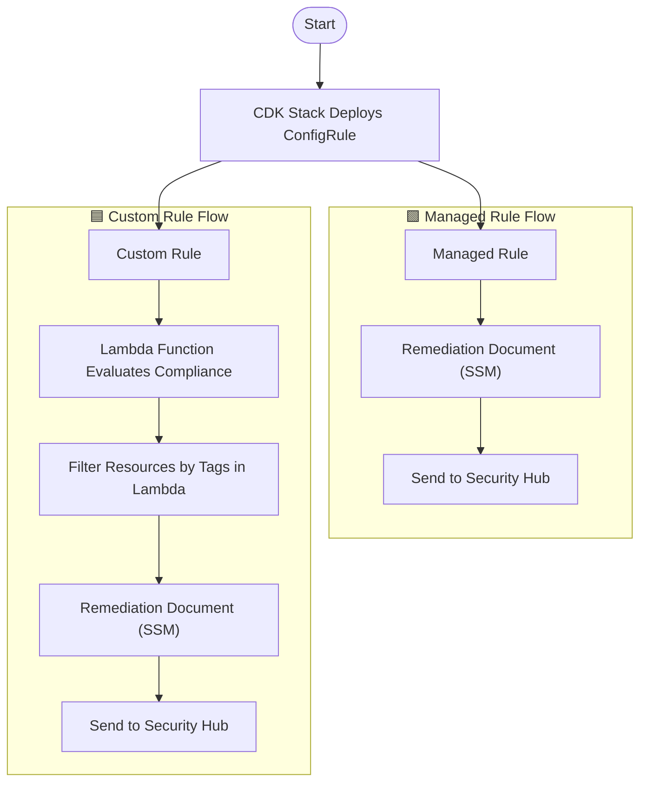
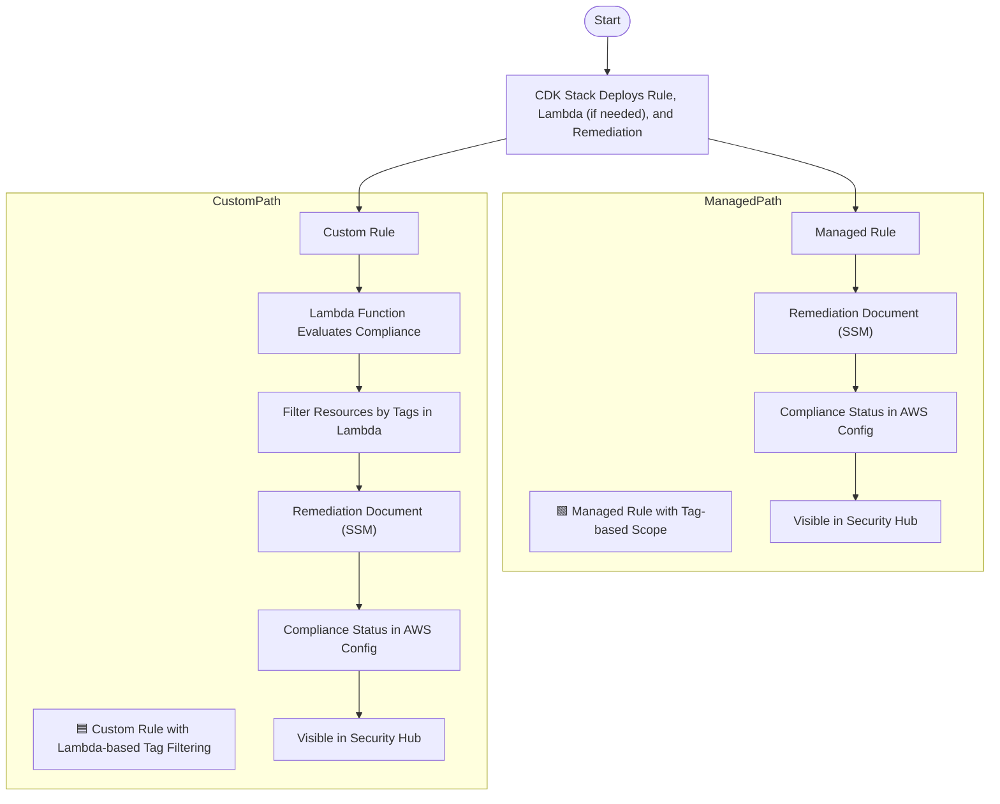

```mermaid
flowchart TD
    A([Start]) --> B["CDK Stack Deploys ConfigRule"]

    B --> C["Managed Rule"]
    B --> D["Custom Rule"]

    C --> E["Remediation Document (SSM)"]
    E --> F["Send to Security Hub"]

    D --> G["Lambda Function Evaluates Compliance"]
    G --> H["Remediation Document (SSM)"]
    H --> I["Send to Security Hub"]
```

```mermaid
flowchart TD
    A([Start]) --> B["CDK Stack Deploys ConfigRule"]

    B --> C["Managed Rule"]
    B --> D["Custom Rule"]

    subgraph ManagedPath ["🟩 Managed Rule Flow"]
        C --> E["Remediation Document (SSM)"]
        E --> F["Send to Security Hub"]
    end

    subgraph CustomPath ["🟦 Custom Rule Flow"]
        D --> G["Lambda Function Evaluates Compliance"]
        G --> G1["Filter Resources by Tags in Lambda"]
        G1 --> H["Remediation Document (SSM)"]
        H --> I["Send to Security Hub"]
    end
```

```mermaid
flowchart TD
    A([Start]) --> B["CDK Stack Deploys Rule, Lambda (if needed), and Remediation"]

    %% Managed Rule Subgraph
    subgraph ManagedPath
        direction TB
        T1["🟩 Managed Rule with Tag-based Scope"]
        C["Managed Rule"]
        C --> E["Remediation Document (SSM)"]
        E --> FC["Compliance Status in AWS Config"]
        FC --> F["Visible in Security Hub"]
    end

    %% Custom Rule Subgraph
    subgraph CustomPath
        direction TB
        T2["🟦 Custom Rule with Lambda-based Tag Filtering"]
        D["Custom Rule"]
        D --> G["Lambda Function Evaluates Compliance"]
        G --> G1["Filter Resources by Tags in Lambda"]
        G1 --> H["Remediation Document (SSM)"]
        H --> HC["Compliance Status in AWS Config"]
        HC --> I["Visible in Security Hub"]
    end

    B --> C
    B --> D
```
