```mermaid
flowchart TD
  A([Start]) --> B["CDK Stack Deploys ConfigRule with Remediation SSM Document"]

  B --> C["AWS Managed Config Rule"]
  B --> D["Custom Config Rule"]

  subgraph ManagedPath ["🟩 AWS Managed Rule Flow"]
    C --> CE["AWS Config Evaluates Compliance based on TagScope (ConfigRule=True)"]
    CE --> MC["✅ COMPLIANT"]
    CE --> MNC["❌ NON-COMPLIANT"]
    MNC --> E["Remediation Document (SSM)"]
    MC --> MF["🛡️ Compliance Status Visible in Security Hub"]
    E --> MF
  end

  subgraph CustomPath ["🟦 Custom Rule Flow"]
    D --> DE["Lambda Function Evaluates Compliance"]
    DE --> G["Filter Resources by Tag (ConfigRule=True) in Lambda"]
    G --> CC["✅ COMPLIANT"]
    G --> CNC["❌ NON-COMPLIANT"]
    CNC --> H["Remediation Document (SSM)"]
    CC --> CF["🛡️ Compliance Status Visible in Security Hub"]
    H --> CF
  end
```

Here’s a crisp and clear **JIRA description** that summarizes the purpose and flow shown in your diagram:

---

### **Description: AWS Config Rule & Remediation Deployment via CDK**

This task implements a CDK-based deployment for both **AWS Managed** and **Custom Config Rules** with associated **SSM Remediation Documents**. The solution enforces compliance evaluation and automates remediation for **tag-scoped resources** (`ConfigRule=True`).

### **Flow Summary**:

* The CDK stack provisions:

  * AWS Config Rules (Managed & Custom)
  * Remediation SSM Documents
* **Managed Rules** are evaluated directly by AWS Config using tag scope.
* **Custom Rules** use a Lambda function to evaluate compliance based on resource tags.
* Compliance results are categorized as:

  * ✅ **COMPLIANT** – No action needed.
  * ❌ **NON-COMPLIANT** – Triggers remediation via SSM document.
* Compliance statuses (for both outcomes) are reported to **AWS Security Hub**.

### **Value Delivered**:

* Enforces consistent compliance across tagged resources.
* Automates remediation for NON-COMPLIANT findings.
* Improves visibility by integrating with Security Hub.

---

Let me know if you also need an **epic link, labels, or acceptance criteria** for JIRA.

AWS Config watches for resource changes or uses a schedule → then invokes the Lambda function you defined in your custom rule → Lambda runs compliance logic → returns result back to AWS Config.
