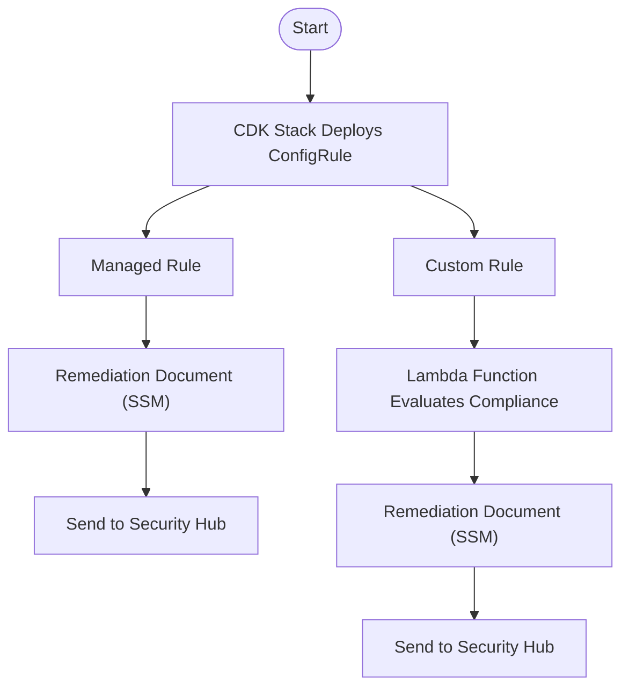
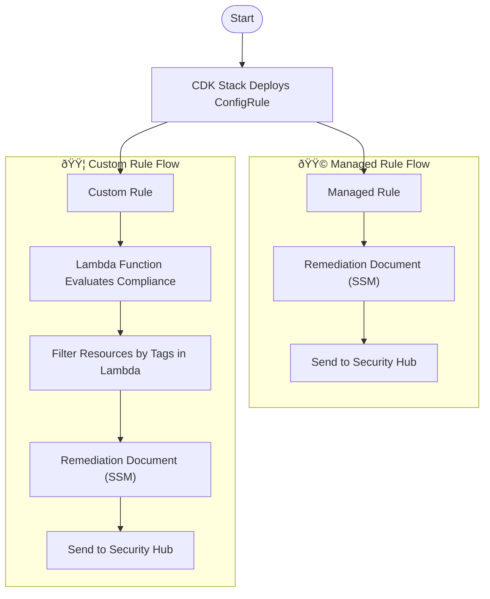
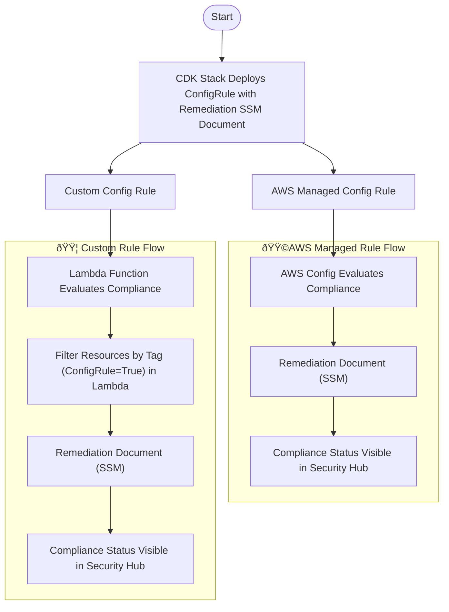

```mermaid
flowchart TD
    A([Start]) --> B["CDK Stack Deploys ConfigRule"]

    B --> C["Managed Rule"]
    B --> D["Custom Rule"]

    C --> E["Remediation Document (SSM)"]
    E --> F["Send to Security Hub"]

    D --> G["Lambda Function Evaluates Compliance"]
    G --> H["Remediation Document (SSM)"]
    H --> I["Send to Security Hub"]
```

```mermaid
flowchart TD
    A([Start]) --> B["CDK Stack Deploys ConfigRule"]

    B --> C["Managed Rule"]
    B --> D["Custom Rule"]

    subgraph ManagedPath ["🟩 Managed Rule Flow"]
        C --> E["Remediation Document (SSM)"]
        E --> F["Send to Security Hub"]
    end

    subgraph CustomPath ["🟦 Custom Rule Flow"]
        D --> G["Lambda Function Evaluates Compliance"]
        G --> G1["Filter Resources by Tags in Lambda"]
        G1 --> H["Remediation Document (SSM)"]
        H --> I["Send to Security Hub"]
    end
```

```mermaid
flowchart TD
  A([Start]) --> B["CDK Stack Deploys ConfigRule with Remediation SSM Document"]

  B --> C["AWS Managed Config Rule"]
  B --> D["Custom Config Rule"]

  C --> CE["AWS Config Evaluates Compliance"]
  D --> DE["Lambda Function Evaluates Compliance"]

  subgraph ManagedPath ["🟩AWS Managed Rule Flow"]
    CE --> E["Remediation Document (SSM)"]
    E --> F["Compliance Status Visible in Security Hub"]
  end

  subgraph CustomPath ["🟦 Custom Rule Flow"]
    DE --> G["Filter Resources by Tag (ConfigRule=True) in Lambda"]
    G --> H["Remediation Document (SSM)"]
    H --> I["Compliance Status Visible in Security Hub"]
  end
```