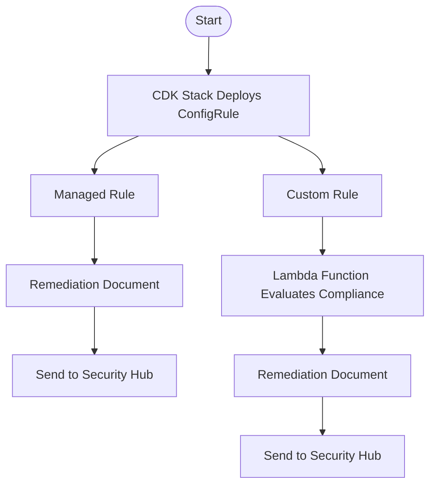

```mermaid
flowchart TD
    A([Start]) --> B[CDK Stack Deploys ConfigRule]
    B --> C[Managed Rule]
    B --> D[Custom Rule]
    C --> E1[Remediation Document]
    E1 --> F1[Send to Security Hub]
    D --> E[Lambda Function Evaluates Compliance]
    E --> F[Remediation Document]
    F --> G[Send to Security Hub]
```
